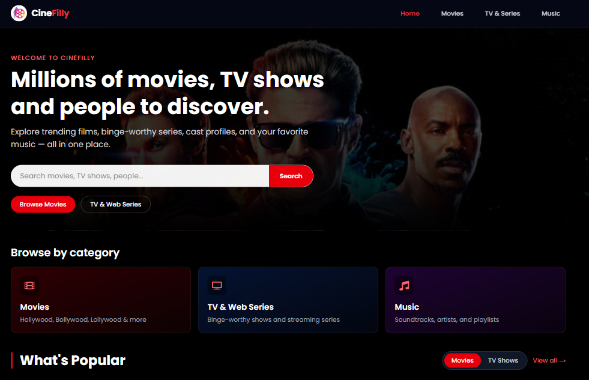
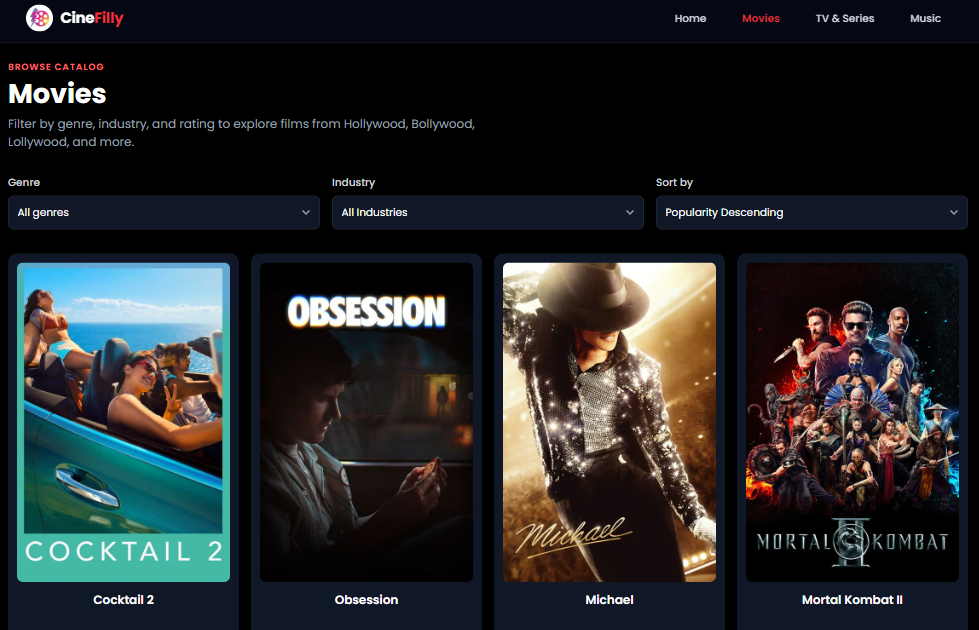
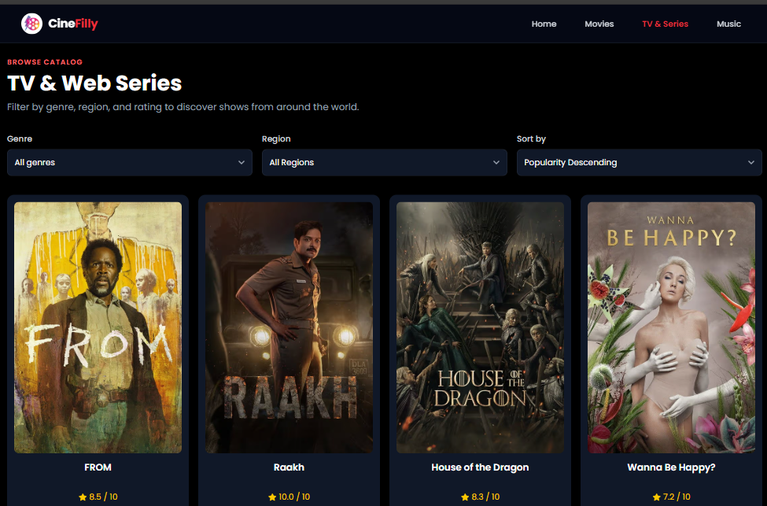
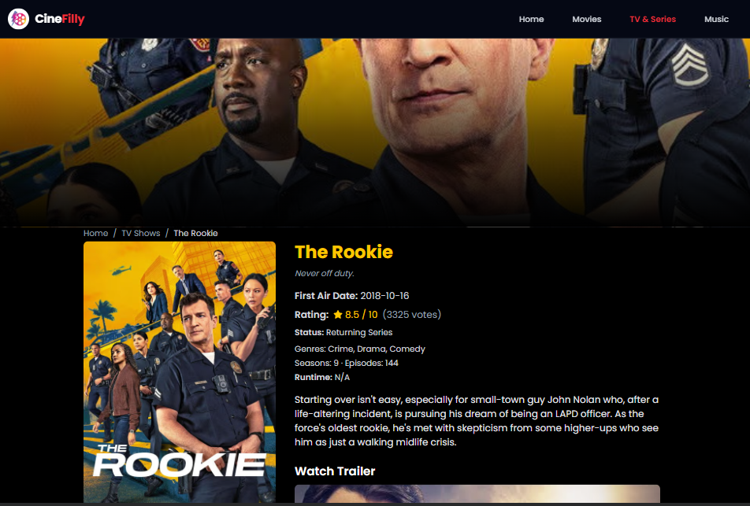
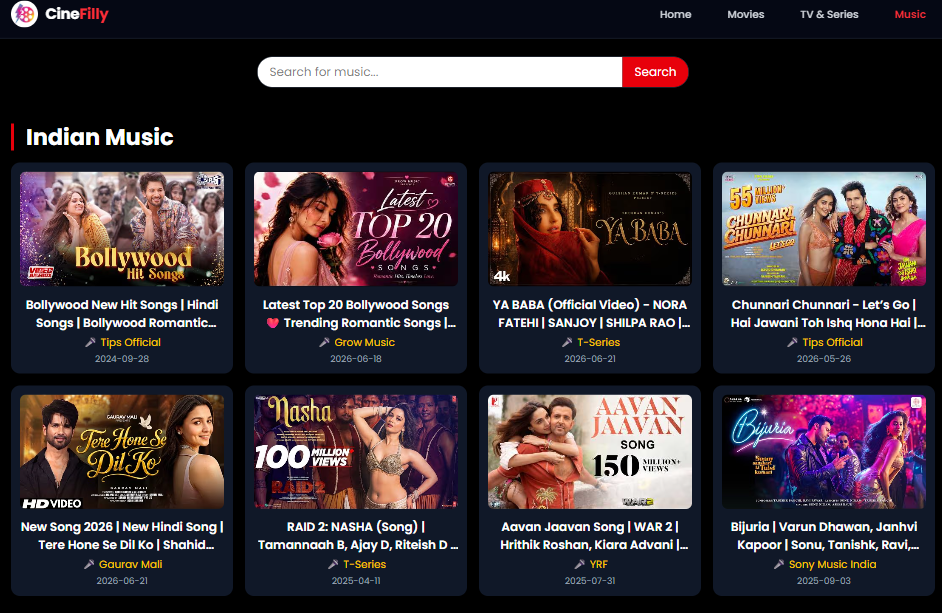
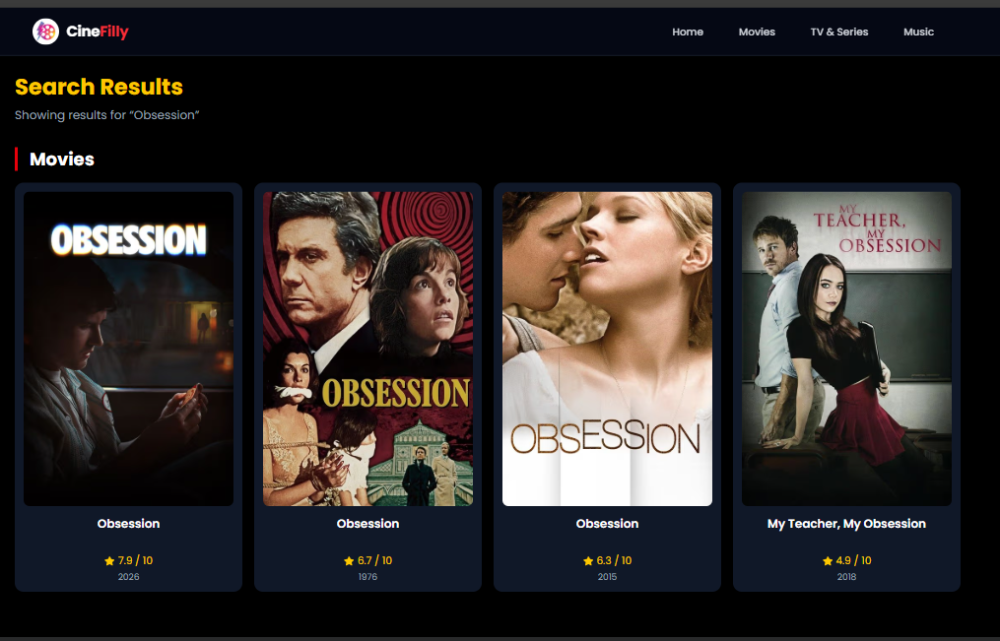
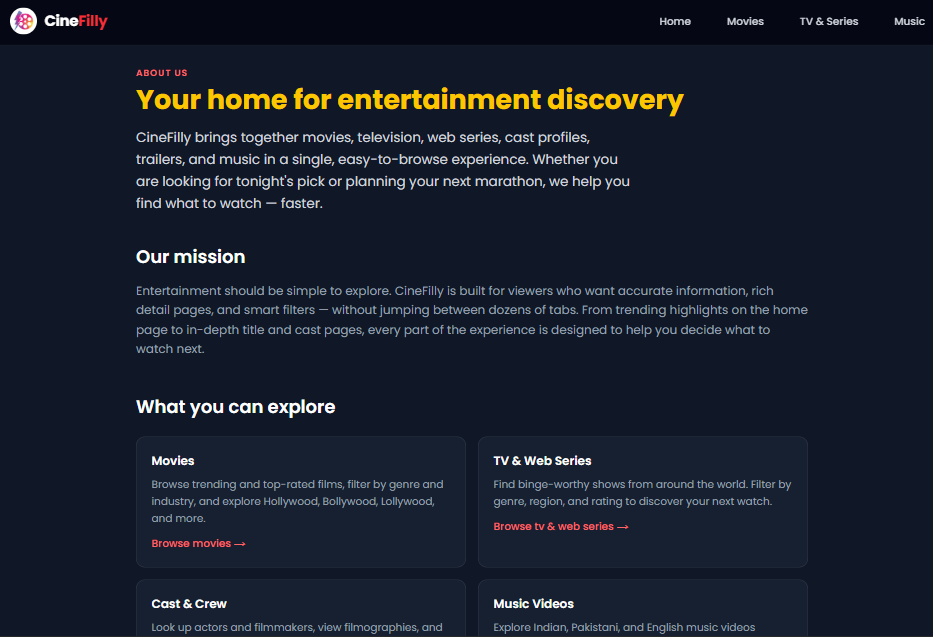
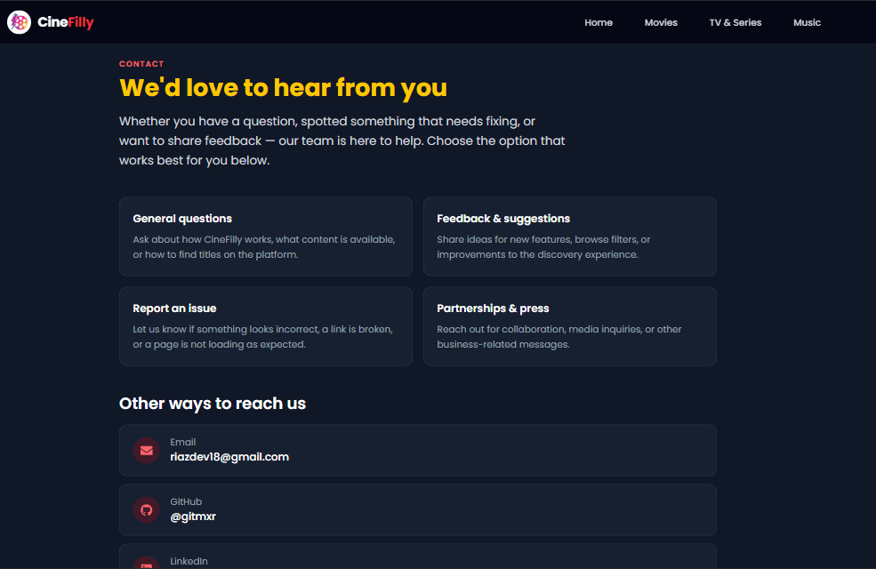

# 🎬 CineFilly — Movies, TV & Music Discovery

<p align="center">
  
</p>

<p align="center">
  <strong>A modern full-stack web app for discovering movies, TV shows, web series, cast profiles, and music videos</strong>
</p>

<p align="center">
  
  
  
  
  
  
</p>

<p align="center">
  <a href="https://cine-filly.vercel.app"><strong>🌐 Live Demo</strong></a>
  &nbsp;•&nbsp;
  <a href="https://github.com/gitmxr/CineFilly">GitHub</a>
</p>

---

## ✨ Features

- 🏠 **Home Hub** — Trending movies, TV shows, top-rated highlights, and quick browse categories in one place
- 🎥 **Movie Browse** — Filter by genre, sort, and industry (Hollywood, Bollywood, Lollywood, and more)
- 📺 **TV & Web Series** — Dedicated browse page with genre, region, and rating filters
- 🔍 **Multi-Search** — Search movies, TV shows, and people with debounced preview on the home page
- 📄 **Rich Detail Pages** — Movies, TV shows, cast profiles, and music videos with trailers and similar titles
- 🎶 **Music Discovery** — Indian, Pakistani, and English music video sections with inline playback
- 📱 **Responsive Design** — Mobile-first layout with custom filter bottom sheets on small screens
- ⚡ **Server Components & ISR** — Server-rendered pages with tuned revalidation and fetch caching
- 🔎 **SEO Optimized** — Metadata API, Open Graph, Twitter cards, JSON-LD, sitemap, and robots.txt
- ♿ **Accessible UI** — Skip links, semantic HTML, ARIA labels, and reduced-motion support
- 🔒 **Security Hardened** — CSP headers, API rate limiting, and input validation
- 📊 **Analytics Ready** — Vercel Analytics and Speed Insights integration
- 🧪 **Tested CI Pipeline** — Type-check, lint, 45+ tests, and build on every deploy

---

## 🗺️ Routes

| Route | Description |
| --- | --- |
| `/` | Home hub — trending, popular, top-rated, search preview |
| `/movies` | Movie browse with genre, industry, and sort filters |
| `/tv` | TV & web series browse with genre, region, and sort filters |
| `/movie/[id]` | Movie detail — cast, trailer, similar films |
| `/tv/[id]` | TV show detail — cast, trailer, similar series |
| `/person/[id]` | Cast & crew profile with filmography |
| `/music` | Music video sections (Indian, Pakistani, English) |
| `/music/[id]` | Music video detail with similar songs |
| `/search/[query]` | Multi-type search results (noindex) |
| `/about` | About page |
| `/contact` | Contact form and social links |

> Legacy `/explore/movie` and `/explore/tv` URLs redirect to `/movies` and `/tv`.

---

## 📱 Screenshots

| **Home** | **Movies Browse** | **TV Browse** | **Movie Detail** |
| :---: | :---: | :---: | :---: |
|  |  |  |  |

| **Music** | **Search** | **About** | **Contact** |
| :---: | :---: | :---: | :---: |
|  |  |  |  |

---

## 🛠️ Tech Stack

| Technology | Purpose |
| --- | --- |
| **Next.js 16** | App Router, SSR, SSG, ISR, and API routes |
| **React 19** | UI with Server and Client Components |
| **TypeScript** | Type-safe development across the codebase |
| **Tailwind CSS v4** | Utility-first styling and responsive layouts |
| **Zustand** | Client state (search history, music, toasts) |
| **SWR** | Client-side data fetching where interactivity is needed |
| **Framer Motion** | Card animations and motion effects |
| **Vitest** | Unit and integration testing |
| **Testing Library** | Component testing with user-event simulation |
| **TMDB API** | Movies, TV, cast, posters, and trailers |
| **YouTube Data API** | Music video search, details, and embeds |
| **Vercel** | Production hosting, previews, and analytics |

---

## 🏗️ Architecture

```
CineFilly/
├── app/                          # Next.js App Router
│   ├── page.tsx                  # Home hub (movies + TV + search preview)
│   ├── movies/                   # Movie browse (genre, industry, sort)
│   ├── tv/                       # TV & web series browse
│   ├── movie/[id]/               # Movie detail (ISR + JSON-LD)
│   ├── tv/[id]/                  # TV detail (ISR + JSON-LD)
│   ├── person/[id]/              # Cast & crew profiles
│   ├── music/                    # Music listing & detail pages
│   ├── search/[query]/           # Multi-type search results
│   ├── explore/[mediaType]/      # Legacy redirects → /movies or /tv
│   ├── about/ & contact/         # Static pages
│   ├── api/                      # Server-side API routes (TMDB, YouTube)
│   ├── layout.tsx                # Root layout, metadata, providers
│   ├── sitemap.ts                # Dynamic sitemap (static + trending URLs)
│   └── robots.ts                 # Crawler rules
├── components/
│   ├── home/                     # HomeHubContent, PopularSection, BrowseCategories
│   ├── movies/                   # MoviesBrowseContent, MovieDetailView, HeroBanner
│   ├── tv/                       # TVDetailView
│   ├── explore/                  # ExploreContent (TV browse filters)
│   ├── media/                    # MediaCard, CastGrid, carousels
│   ├── music/                    # MusicCard, MusicContent, MusicDetailView
│   ├── search/                   # SearchResultsContent (server component)
│   ├── seo/                      # JsonLd structured data
│   ├── ui/                       # Header, Footer, FilterSelect, skeletons
│   └── analytics/                # Web Vitals, Vercel Analytics
├── lib/
│   ├── api/                      # TMDB, YouTube, validation, rate-limit, cache
│   ├── seo/                      # buildPageMetadata, canonical URLs
│   ├── stores/                   # Zustand stores (search, music, toast)
│   ├── hooks/                    # useDebouncedValue, useMultiSearch
│   └── types/                    # Shared TypeScript interfaces
├── tests/                        # Vitest setup and mocks
├── proxy.ts                      # API rate limiting (60 req/min)
├── next.config.ts                # Images, security headers, CSP
└── vercel.json                   # CI build pipeline config
```

### Data flow

1. **Server pages** fetch browse and detail data via `lib/api/tmdb.ts` and `lib/api/youtube.ts` with ISR revalidation
2. **Client components** handle filters, pagination, search preview, and playback
3. **API routes** proxy external APIs so keys never reach the browser
4. **Proxy** rate-limits `/api/*` to protect quota and prevent abuse

---

## 🎨 Design Highlights

- **Cinematic Dark Theme** — Black/gray backgrounds with red and yellow accents
- **Skeleton Loaders** — Route-level and in-component loading states (no full-page spinners)
- **Custom Filter UI** — Desktop dropdowns and mobile bottom-sheet selects
- **Animated Cards** — Subtle hover and scroll effects (respects `prefers-reduced-motion`)
- **Optimized Images** — `next/image` with AVIF/WebP and TMDB CDN patterns
- **Breadcrumb Navigation** — Clear hierarchy on detail pages
- **Sticky Header** — Active nav state across browse and detail routes

---

## 🚀 Getting Started

### Prerequisites

- **Node.js** 20 or higher
- **npm** 10 or higher
- **TMDB API key** — [Get one here](https://www.themoviedb.org/settings/api)
- **YouTube Data API key** — [Google Cloud Console](https://console.cloud.google.com/)

### Installation

1. **Clone the repository**

```bash
git clone https://github.com/gitmxr/CineFilly.git
cd CineFilly
```

2. **Install dependencies**

```bash
npm install
```

3. **Set up environment variables**

```bash
cp .env.local.example .env.local
```

Edit `.env.local`:

```env
TMDB_API_KEY=your_tmdb_api_key
YOUTUBE_API_KEY=your_youtube_api_key
NEXT_PUBLIC_SITE_URL=http://localhost:3000
```

4. **Start the development server**

```bash
npm run dev
```

Open [http://localhost:3000](http://localhost:3000)

---

## 📦 Scripts

| Command | Description |
| --- | --- |
| `npm run dev` | Start Next.js dev server |
| `npm run build` | Production build |
| `npm run start` | Run production server locally |
| `npm run type-check` | TypeScript validation (`tsc --noEmit`) |
| `npm run lint` | ESLint (Next.js core-web-vitals + TypeScript) |
| `npm run test` | Run Vitest test suite |
| `npm run test:watch` | Vitest in watch mode |
| `npm run test:coverage` | Tests with V8 coverage report |
| `npm run analyze` | Bundle analysis build (`ANALYZE=true`) |

---

## 🌐 Deploy to Vercel

### 1. Connect repository

1. Push to GitHub
2. Import the repo at [vercel.com/new](https://vercel.com/new)
3. Framework preset: **Next.js** (auto-detected)

### 2. Environment variables

| Name | Environments |
| --- | --- |
| `TMDB_API_KEY` | Production, Preview, Development |
| `YOUTUBE_API_KEY` | Production, Preview, Development |
| `NEXT_PUBLIC_SITE_URL` | Production (your domain, e.g. `https://cine-filly.vercel.app`) |

### 3. Build command

Vercel runs the full quality pipeline on every deploy:

```bash
npm run type-check && npm run lint && npm run test && npm run build
```

### 4. Post-deploy checklist

- [ ] Home page loads with trending movies and TV sections
- [ ] `/movies` browse and industry filters work
- [ ] `/tv` browse and region filters work
- [ ] Movie and TV detail pages show trailers
- [ ] Music page and search work
- [ ] `/api/health` returns `{ "status": "ok" }`
- [ ] `/sitemap.xml` and `/robots.txt` are reachable

### Health endpoint

```
GET /api/health
```

| Status | Response |
| --- | --- |
| `200` | `{ "status": "ok", "timestamp": "..." }` |
| `503` | `{ "status": "degraded", "timestamp": "..." }` |

---

## 🔐 Security

- API keys are **server-only** (never `NEXT_PUBLIC_`)
- **Content-Security-Policy** and security headers in `next.config.ts`
- **Rate limiting** on API routes (60 requests/minute per IP via `proxy.ts`)
- **Input validation** for media IDs, video IDs, search queries, and pagination
- Sanitized error responses (no upstream API leaks)
- `.env` files are gitignored — never commit secrets

---

## 🔎 SEO

- Centralized metadata via `lib/seo/metadata.ts` (`buildPageMetadata`)
- Per-route static and dynamic metadata (`generateMetadata` on detail and browse pages)
- Open Graph and Twitter card images (posters/thumbnails where available)
- JSON-LD on movie, TV, person, and music detail pages
- Dynamic `sitemap.xml` with static routes and trending movie/TV URLs
- `robots.txt` disallows `/api/` and `/search/` to avoid thin duplicate content

---

## 🧪 Testing

```bash
# Run all tests
npm run test

# Watch mode
npm run test:watch

# Coverage report
npm run test:coverage
```

Tests cover API routes, discover validation, rate limiting, Zustand stores, utilities, and core UI components.

---

## 🤝 Contributing

Contributions are welcome!

1. Fork the repository
2. Create a feature branch (`git checkout -b feature/amazing-feature`)
3. Commit your changes (`git commit -m 'Add amazing feature'`)
4. Push to the branch (`git push origin feature/amazing-feature`)
5. Open a Pull Request

Please ensure `npm run type-check`, `npm run lint`, and `npm run test` pass before submitting.

---

## 📜 Legacy Code

The original **React + Vite** app is preserved on the `legacy/react-vite` git branch for reference. The production app is **Next.js only**.

---

## 👨‍💻 Author

**Muhammad Riaz**

- GitHub: [@gitmxr](https://github.com/gitmxr)
- LinkedIn: [riazdev18](https://linkedin.com/in/riazdev18)
- Email: [riazdev18@gmail.com](mailto:riazdev18@gmail.com)

---

## ⭐ Show Your Support

If you find CineFilly useful, give the repo a **star** on GitHub!

---

<p align="center">
  Made with ❤️ using Next.js, React, and TypeScript
</p>
